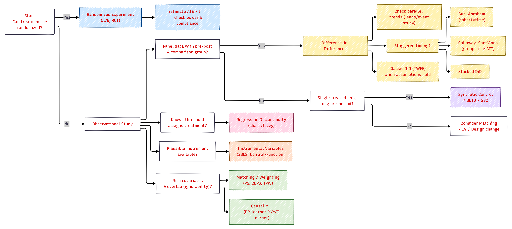
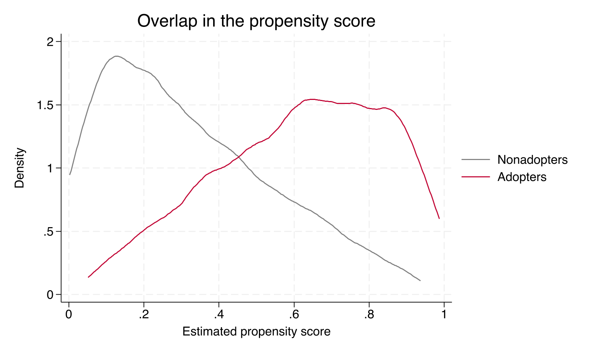
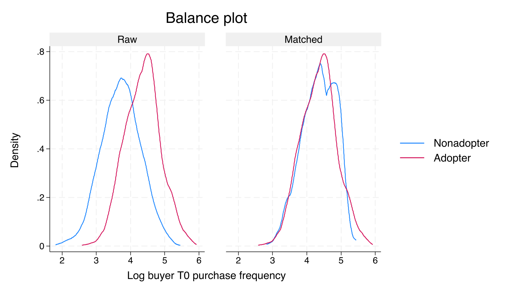
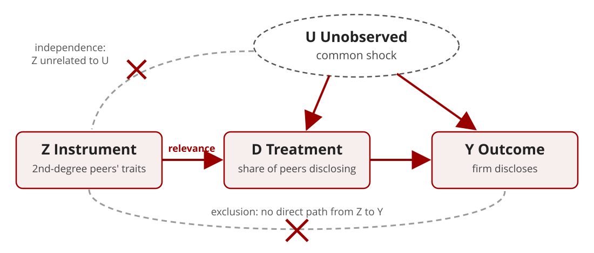
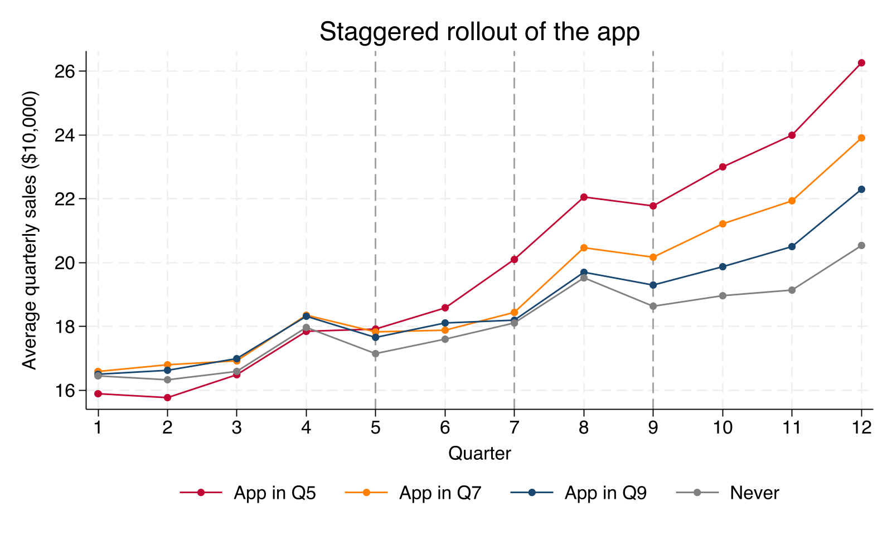
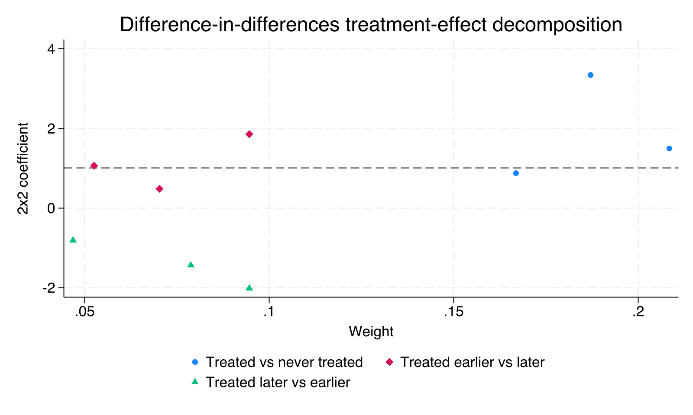
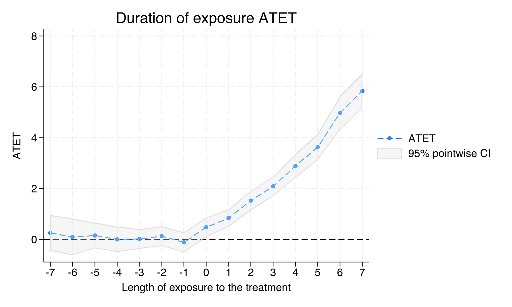

# Introduction and Basics

## What is Causality

- The concept that often turns research papers into casualties

<br>

- Before we get started, a quick poll (show of hands):
  - **Who primarily runs behavioral experiments?**
  - **Who primarily analyzes observational data?**

<br>

- Why is `causality` important in the context of business research?

<br>

- Do you think <span style="color:#990000">behavioral researchers</span> need to worry about causality?


# What is Causality

- Causality is the link between a **cause** and an **effect**, and it underlies nearly every research claim.
- One thing (the **cause**) sets another thing (the **effect**) in motion.

- To call a relationship causal, three conditions must hold:
  1. **Temporal precedence.** The cause must occur *before* the effect.
  2. **Concomitant variation.** When the cause changes, the effect changes with it.
  3. **No confounding factors.** The effect cannot be explained by some other variable.


## The Fundamental Problem

- **Concern.** We only observe *one outcome* for any given unit.
- **Solution.** Construct a **counterfactual**, which is both the key to identification and its main point of vulnerability.
- Candidate counterfactuals:
  - The same unit at an earlier point in time?
  - Other units that were not treated?

<br>

::: {.fragment}

> *Every causal claim rests on a comparison to what would have happened otherwise.*

:::


## Potential Outcomes Framework

-   The `potential outcomes framework` is a way to think about cause and effect.

-   Imagine two scenarios for each situation, with and without a `cause` (treatment, intervention, event).

-   Each scenario has a `potential outcome`, what would happen in each case.

-   We can only `observe one outcome` in reality.

    -   Solution - `Counterfactuals`

-   `Treatment Effect` - can only be estimated but not calculated

    -   <sub><sup>ATE, ATT/ATET, LATE</sub></sup>


## Some Assumptions of the Potential Outcomes Framework

-   Stable Unit Treatment Value Assumption (`SUTVA`)
    -   <sub><sup> The `potential outcomes` for any unit do not vary with the treatment assigned to other units (`no interference`)
    -   <sub><sup>For each unit, there are no different versions of each treatment level (`no hidden variation of treatments`)
-   Another way of explaining `SUTVA`
    -   <sub><sup> `SUTVA` requires that the outcome of a particular unit depends only on the treatment to which the unit was assigned, not the treatments of other units (spillovers)
-   Example of a violation
    -   <sub><sup> Imagine an A/B test for a food delivery app that prioritizes deliveries for one group. While results might show faster deliveries for the prioritized group, it could be misleading. Since there are a limited number of drivers, prioritizing some orders can slow down deliveries for others who share those drivers. This "faster delivery" benefit wouldn't be due solely to the new feature, but because of competition for shared resources.

## Exchangeability (a.k.a. Ignorability)

- **Definition.**
  Once we control for all confounders \(X\), the potential outcomes `Y(1)` and `Y(0)` are *independent* of treatment assignment `D`.


- **Example (Marketing Context)**
  - Suppose we want to estimate the causal effect of a **loyalty email campaign** on customer spending.
  - If customers who already have higher purchase intent are more likely to be targeted, naive comparisons will be biased.
  - But if we can control for **past spending, demographics, browsing activity, and seasonality**, then the treated and untreated groups become *exchangeable* within those covariate profiles.

::: {.fragment}

> *Exchangeability means that, after conditioning, treatment looks random.*

:::

---

### Violations of Exchangeability

- Omitted variables, such as unobserved brand affinity or unmeasured social influence.
- Reverse causality, where treatment reacts to the outcome.
- Bad controls, where including mediators (post-treatment variables) breaks the logic.

- **Fixes**
  - Improve design (pre-treatment controls only).
  - Use **IV**, **DiD**, or **Matching** to approximate random assignment.

## Positivity (a.k.a. Overlap)

- **Definition.**
  Every unit has a positive probability of receiving each treatment level,
  $$0 < P(D=1 \mid X) < 1$$
  This ensures there is enough "common support" across groups.

- **Intuition.**
  For every type of person (covariate pattern), you can find both treated and untreated examples in your data.

---

### Example (Marketing Context)

- Suppose you want to estimate the effect of **personalized discount offers** on purchase conversion.
- If *all* high-income customers **always** receive offers, and *none* of the low-income customers **ever** do, then you cannot estimate the causal effect for high-income customers because there is no untreated comparison group.

::: {.fragment}

> *Without overlap, you are comparing apples to non-existent oranges.*

:::

---

### Why Positivity Matters

- Without overlap, your model **extrapolates** instead of **identifying**.
- Violation examples:
  - Policy reforms that apply only to one state (need DiD or synthetic control).
  - Ads shown only to a specific demographic.
- Remedies:
  - Trim non-overlapping observations (common support region).
  - Redefine the population of inference.


# End of Theory and Moving to Practice


## Choosing the Right Causal Method

{.r-stretch fig-alt="Decision tree for choosing a causal method"}


## From Experiments to Quasi-Experiments

> **Why this shift?** Experiments are the gold standard, but in policy, marketing, and organizations, true randomization is often **impractical, unethical, or impossible**. Quasi-experiments let us recover credible causal effects anyway.

- We use **observational data** to approximate experimental logic.
- Leverage **pre/post** structure and **plausibly exogenous** variation.
- Trade-offs between stronger **internal validity** on one side and assumptions and **generalizability** concerns on the other.

---

## What We Will Cover Today {.smaller}

:::: {.columns}
::: {.column width="50%"}
### 1. Matching approaches
- **When.** Selection on **observed** characteristics
- **Methods.** Propensity score matching, inverse probability weighting, doubly robust estimators
- **Example.** A B2B mobile app and buyer sales (Gill, Sridhar, and Grewal 2017, *JM*)
:::

::: {.column width="50%"}
### 2. Instrumental variables
- **When.** Selection on **unobserved** characteristics
- **Methods.** Two-stage least squares, first-stage and overidentification diagnostics, weak and invalid instruments
- **Example.** Herding in advertising spending disclosure (Shi, Grewal, and Sridhar 2021, *JMR*)
:::
::::

::: {.fragment}

- **Appendix (self-study).** Difference-in-differences, event studies, and staggered adoption
- Each method comes with a **live Stata demonstration** on simulated data where the true effect is known. All do-files and data are on the course GitHub page.

:::


# Matching Approaches

## Selection on Observables

- Matching estimators take **exchangeability** and **positivity** as their identifying assumptions.
  - Exchangeability, $\{Y(1), Y(0)\} \perp D \mid X$, means we observe *every* confounder.
  - Positivity, $0 < P(D=1 \mid X) < 1$, means comparable treated and untreated units exist.
- Matching makes treated and control groups look alike **on observed covariates**.
- It does **not** address unobserved confounders. Its credibility depends on the argument for why $X$ is sufficient.

## Why Not Just Regression?

- Regression also "controls for" $X$, but it
  - imposes a functional form (usually linear and additive),
  - extrapolates silently into regions with no overlap, and
  - mixes design and analysis, since balance is never checked.
- Matching and weighting separate the **design stage** (build a comparable sample, check balance) from the **analysis stage** (estimate the effect).

::: {.fragment}

> *Design the study before you look at the outcome* (Rubin 2008).

:::

## Running Example: A B2B Engagement App

- Gill, Sridhar, and Grewal (2017, *Journal of Marketing*)
- A tool manufacturer launches a **free mobile app** that helps buyers search for tools and design machining processes.
  - The app is not a sales channel. Does it still raise purchases?
- The firm could not randomize, because for fairness the app was available to every buyer.
- **Data.** 522 buyers that adopted the app and 626 that did not; sales in the 15 months before and after launch.
- **Selection concern.** Buyers adopt strategically, expecting cost savings. Frequent, powerful buyers are both more likely to adopt and more valuable to begin with.

## What Drives Adoption?

From interviews with the app team, the authors identify covariates that proxy for buyers' expected cost savings.

- **Buyer power**, the buyer's share of the seller's sales in its division
- **Buyer firm size** (employees)
- **Buyer industry competitiveness** (1 minus the concentration ratio)
- **T0 sales and T0 purchase frequency**, in the five months before the pre-period
- **Continent and industry division**

::: {.fragment}

In the paper, adopters made almost twice as many T0 purchases as nonadopters (97 vs. 51, $t = -5.91$).

:::

## Our Simulated Version {.smaller}

- We simulate 1,148 buyers whose covariates, sales, and adoption mirror the paper's Table 4 and Figure 1.
- Adoption depends **only on observed covariates** (selection on observables holds by construction).
- Buyers who purchase frequently are more likely to adopt **and** on a steeper sales path even without the app.
- Because we generated the data, we **know the true effect**.

::: {.fragment}

| Group | Pre-launch sales | Post-launch sales | Change | T0 frequency | Buyer power |
|-------|-----:|-----:|-----:|-----:|-----:|
| Nonadopters (626) | 77.6 | 74.6 | −3.0 | 48.4 | 51.8 |
| Adopters (522) | 83.0 | 105.1 | 22.1 | 88.6 | 81.5 |

<sub><sup>Sales in $10,000. Outcome used throughout is the change in sales, post minus pre.</sup></sub>

:::

## The Naive Estimate

- Compare the change in sales for adopters and nonadopters,
  $$\widehat{\tau}_{naive} = 22.1 - (-3.0) = 25.1$$
- Is this the effect of the app?
- Adopters differed **before** the launch. Their T0 purchase frequency has a standardized difference of 1.16, and buyer power 0.82.
- Frequent buyers were going to grow faster anyway, so part of the 25.1 is **selection**, not the app.

## The Propensity Score

- **Definition.** The probability of treatment given covariates,
  $$e(X) = P(D = 1 \mid X)$$
- **Key result** (Rosenbaum and Rubin 1983). If exchangeability holds given $X$, it also holds given $e(X)$.
  - Units with the same propensity score have the same distribution of $X$, whether treated or not.
- **Dimension reduction.** Instead of matching on many covariates, we match or weight on a single number.
- In practice $e(X)$ is unknown and estimated, usually with a logit or probit.
  - In the example, $e(X)$ is a buyer's probability of adopting the app.

## ATT vs. ATE {.smaller}

:::: {.columns}
::: {.column width="50%"}
### ATE
$$E[Y(1) - Y(0)]$$

- Average effect across **all** units, treated or not.
- Answers "what if we rolled the app out to **every** buyer?"
- Requires comparable treated units for every control, and vice versa.
- Stata: `teffects ...` (default)
:::

::: {.column width="50%"}
### ATT
$$E[Y(1) - Y(0) \mid D = 1]$$

- Average effect among units that **actually received** treatment.
- Answers "did the app pay off for the buyers who **adopted**?"
- Requires comparable controls for the treated only.
- Stata: `teffects ..., atet`
:::
::::

::: {.fragment}

- The two are equal only if effects are homogeneous, or if treated and untreated units have the same mix of effects.
- In the example, the effect grows with purchase frequency and frequent buyers adopt, so **ATT = 15.85 > ATE = 14.63**.

:::

## Two Ways to Use the Propensity Score

:::: {.columns}
::: {.column width="50%"}
### Matching (PSM)
- Pair each adopter with nonadopter(s) of similar $e(X)$.
- Discard unmatched units.
- Natural target is the **ATT**, the effect for buyers who adopted.
:::

::: {.column width="50%"}
### Weighting (IPW)
- Keep every buyer, but weight by the inverse of the probability of the choice actually made.
- Creates a pseudo-population in which adoption is independent of $X$.
- Targets the **ATE** or the **ATT**, depending on the weights.
:::
::::


# Propensity Score Matching

## PSM in Four Steps

1. **Estimate** the propensity score (logit or probit on pre-treatment covariates).
2. **Match** treated units to controls with similar scores.
3. **Check balance** on every covariate in the matched sample.
    - If balance is poor, revise the score model (logs, interactions, polynomials) and return to step 1.
4. **Estimate** the treatment effect in the matched sample.

::: {.fragment}

> *Steps 1 to 3 never touch the outcome variable.*

:::

## Matching Choices {.smaller}

| Choice | Options | Trade-off |
|--------|---------|-----------|
| Number of matches | 1 nearest neighbor, $k$ neighbors | More neighbors lower variance but raise bias |
| Replacement | With, without | With replacement lowers bias; reused controls raise variance |
| Caliper | None, maximum distance | A caliper drops poor matches but can drop treated units, changing the estimand |
| Distance | Propensity score, Mahalanobis | Mahalanobis matches on covariates directly; works well with few covariates |

- A common caliper is 0.2 standard deviations of the **logit** of the propensity score (Austin 2011).
- Gill et al. (2017) report nearest-neighbor matching with Mahalanobis, inverse-variance, and Euclidean distances, and with one to three neighbors.

## Checking Overlap

{.r-stretch fig-align="center" fig-alt="Kernel densities of the estimated propensity score for adopters and nonadopters"}

- Few nonadopters have scores above 0.8, where many adopters sit. Those adopters are matched to the same few controls.

## Checking Balance

- **Standardized mean difference** for covariate $X_k$,
  $$SMD_k = \frac{\bar{X}_{k,T} - \bar{X}_{k,C}}{\sqrt{(s^2_{k,T} + s^2_{k,C})/2}}$$
  - Rule of thumb: $|SMD| < 0.1$ after matching.
- **Variance ratio** $s^2_{k,T}/s^2_{k,C}$ close to 1.
- Compare the **full distribution**, not only the means.
- Do **not** use $t$-tests for balance, since they depend on sample size, which matching changes.

## Balance in the Example {.smaller}

:::: {.columns}
::: {.column width="45%"}

| Covariate | Raw SMD | Matched SMD |
|-----------|-----:|-----:|
| Log firm size | 0.46 | 0.05 |
| Log buyer power | 0.82 | 0.02 |
| Competitiveness | 0.01 | 0.02 |
| Log T0 sales | 0.43 | 0.06 |
| Log T0 frequency | 1.16 | 0.00 |
| Developing economy | 0.04 | 0.07 |
| General engineering | −0.10 | 0.16 |

<sub><sup>One nearest neighbor, ATT. Skewed covariates enter the score in logs; in levels, the variance ratios for firm size (0.52) and T0 frequency (1.52) stay far from 1.</sup></sub>

:::

::: {.column width="55%"}
{width="100%" fig-alt="Density of log T0 purchase frequency for adopters and nonadopters before and after matching"}
:::
::::

## PSM in Stata

```stata
* Load the data and log the skewed covariates
use app_adoption, clear
generate ln_size  = ln(firm_size)
generate ln_power = ln(buyer_power)
generate ln_sales = ln(t0_sales)
generate ln_freq  = ln(t0_freq)

* PSM, ATT, one nearest neighbor (teffects fits the logit in the 2nd parentheses)
teffects psmatch (dsales) ///
    (app ln_size ln_power competitiveness ln_sales ln_freq i.developing i.division), ///
    atet

* Balance: standardized differences near 0, variance ratios near 1
tebalance summarize
tebalance density ln_freq

* Variations: add nneighbor(3) or caliper(0.1) after atet
```

- `teffects` reports Abadie and Imbens (2016) standard errors, which account for the estimated propensity score.

## Cautions About PSM

- **Model dependence.** Results can change with the score specification, the number of neighbors, and the caliper. Report several, as Gill et al. (2017) do.
- **The PSM paradox** (King and Nielsen 2019). With good balance already, further pruning on the score can *increase* imbalance and model dependence.
- **Discarded data.** Matching without replacement or with a tight caliper changes the population you are describing.
- **Inference.** Bootstrapping nearest-neighbor matching estimators is invalid (Abadie and Imbens 2008). Use the analytic standard errors.


# Inverse Probability Weighting

## The Idea

- Adopters who *looked unlikely* to adopt resemble nonadopters, so they get **more weight**, and likewise for nonadopters who looked likely to adopt.
- **ATE weights**
  $$w_i = \frac{D_i}{\hat{e}(X_i)} + \frac{1 - D_i}{1 - \hat{e}(X_i)}$$
- **ATT weights.** Adopters get weight 1; nonadopters get $\hat{e}(X_i)/(1 - \hat{e}(X_i))$, so nonadopters who look like adopters count more.
- The estimate is a weighted difference in means,
  $$\hat{\tau}_{IPW} = \frac{\sum_i w_i D_i Y_i}{\sum_i w_i D_i} - \frac{\sum_i w_i (1 - D_i) Y_i}{\sum_i w_i (1 - D_i)}$$

## Extreme Weights

- When $\hat{e}(X)$ is close to 0 or 1, weights explode and a handful of units drive the estimate.
  - This is a **positivity problem** showing up in the estimator.
  - In the example, the median ATE weight is 1.5 but the largest is 19.3.
- Remedies
  - **Inspect** the weight distribution (maximum, top percentiles).
  - **Trim** the sample to $0.1 \le \hat{e}(X) \le 0.9$ (Crump et al. 2009), which redefines the estimand.
  - **Stabilize** weights by multiplying by the marginal probability of treatment.
  - **Normalize** weights to sum to one within each group (as in the formula above).

## Doubly Robust Estimators

- Combine a **treatment model** for $e(X)$ with an **outcome model** for $E[Y \mid X, D]$.
- The estimate is consistent if **either** model is correctly specified.
- **IPWRA.** Weighted regression adjustment, with outcome models fit using IPW weights.
- **AIPW.** The IPW estimate plus an augmentation term built from the outcome model.
- In practice, a sensible default, and a useful check on PSM and IPW.

## IPW in Stata

```stata
* IPW, ATT (drop atet for the ATE)
teffects ipw (dsales) ///
    (app ln_size ln_power competitiveness ln_sales ln_freq i.developing i.division), ///
    atet

* Balance in the weighted sample, and the overlap plot
tebalance summarize
teoverlap

* Doubly robust, IPWRA: 1st parentheses = outcome model, 2nd = treatment model
teffects ipwra ///
    (dsales firm_size buyer_power competitiveness t0_sales t0_freq i.developing i.division) ///
    (app ln_size ln_power competitiveness ln_sales ln_freq i.developing i.division), ///
    atet

* Doubly robust, AIPW (ATE): replace ipwra with aipw and drop atet
```

- After weighting, every standardized difference in the example is below 0.04.
- Weighting by hand (`regress dsales i.app [pw = w]`) gives the same point estimate, but its standard errors ignore that $\hat{e}(X)$ was estimated.


# Matching: Results and Limits

## Comparing Estimators {.smaller}

Effect of app adoption on the change in 15-month sales ($10,000)

:::: {.columns}
::: {.column width="55%"}

| Estimator | Estimate | SE |
|-----------|---------:|---:|
| Naive difference | 25.08 | 1.43 |
| Regression adjustment (ATT) | 15.18 | 1.71 |
| PSM, 1 neighbor (ATT) | 15.42 | 2.11 |
| PSM, 3 neighbors (ATT) | 15.45 | 2.01 |
| IPW (ATT) | 14.76 | 1.85 |
| IPWRA (ATT) | 14.74 | 1.58 |
| IPW (ATE) | 15.36 | 1.64 |
| AIPW (ATE) | 14.93 | 1.58 |

:::

::: {.column width="45%"}

::: {.fragment}
**The truth** (known only because we simulated)

- True ATT = **15.85**
- True ATE = **14.63**
:::

::: {.fragment}
- The naive estimate overstates the effect by almost 60%.
- Every adjusted estimate is within one standard error of the truth.
- Gill et al. (2017) report 15.3 to 18.3 across matching, IPW, and IPWRA.
:::

:::
::::

## Unobserved Confounding {.smaller}

- Every estimator here assumes **no unobserved confounders**. Balance on $X$ says nothing about balance on what you did not measure.
  - In our simulation this holds by construction. In real data it is an argument, not a fact.
- Gill et al. (2017) address it with a **Heckman selection model**, using the number of buying units as an exclusion restriction (it shifts adoption but not sales).
- Other ways to assess sensitivity
  - **Rosenbaum bounds.** How strong would hidden bias have to be to overturn the result?
  - **E-values** (VanderWeele and Ding 2017). The minimum association an unmeasured confounder would need with both treatment and outcome.
  - **Coefficient stability** (Oster 2019). How much selection on unobservables, relative to observables, would drive the effect to zero?

# Instrumental Variables

## When Selection Is on Unobservables

- Matching and weighting assume we observe **every** confounder.
- Often a confounder $U$ is unobserved and affects both treatment $D$ and outcome $Y$.
  - Balancing $X$ does nothing about $U$, so OLS, PSM, and IPW are all biased.
- **Idea.** Find a source of variation in $D$ that is unrelated to $U$, and use **only** that variation to estimate the effect.
- That source of variation is an **instrument** $Z$.

## The IV Idea

{.nostretch width="78%" fig-align="center" fig-alt="Causal diagram: instrument Z affects treatment D, which affects outcome Y; an unobserved shock U affects D and Y; there is no direct path from Z to Y and no link between U and Z"}

- Only the part of $D$ driven by $Z$ is used, and that part is free of $U$.

## Three Conditions for a Valid Instrument

1. **Relevance.** $Z$ is correlated with $D$, conditional on controls.
    - Testable with the first stage.
2. **Exclusion.** $Z$ affects $Y$ **only** through $D$.
    - Not testable. It must be argued from institutional knowledge.
3. **Independence.** $Z$ is as good as randomly assigned, so it is unrelated to $U$.
    - Not testable either; supported by the design.

::: {.fragment}

- With heterogeneous effects (and monotonicity), IV estimates a **local average treatment effect (LATE)**, the effect for units whose treatment responds to $Z$ (Imbens and Angrist 1994).

:::

## Two-Stage Least Squares (2SLS)

- **First stage.** Regress the endogenous variable on the instruments and controls,
  $$D_i = \pi_0 + \pi_1 Z_i + X_i'\gamma + v_i$$
- **Second stage.** Replace $D_i$ with its fitted value $\hat{D}_i$,
  $$Y_i = \beta_0 + \beta_1 \hat{D}_i + X_i'\delta + \varepsilon_i$$
- With one instrument, 2SLS is a ratio of two regressions,
  $$\hat{\beta}_1 = \frac{\text{effect of } Z \text{ on } Y \text{ (reduced form)}}{\text{effect of } Z \text{ on } D \text{ (first stage)}}$$
- Running the two stages by hand gives the right estimate but the **wrong standard errors**. Use `ivregress`.

## Running Example: Herding in Ad Spending Disclosure

- Shi, Grewal, and Sridhar (2021, *Journal of Marketing Research*)
- A 1994 rule made disclosing advertising spending **voluntary** for U.S. firms. The share of firms disclosing fell sharply.
- **Question.** Do firms copy (herd on) their peers' disclosure decisions?
- **Model.** A linear probability model for 48,509 firm-years,
  $$d_{it} = \alpha + \beta\, PeerDisclosure_{it} + \delta x_{it} + \gamma PEERGROUP_{it} + \text{Industry} \times \text{Year} + e_{it}$$
  - $d_{it} = 1$ if firm $i$ discloses in year $t$; $PeerDisclosure_{it}$ is the share of its peers that disclose.

## Why Peer Disclosure Is Endogenous

- **Reflection problem** (Manski 1993). If a firm and its peers share exactly the same peer group, the peer average is a linear function of the group's own traits and $\beta$ is not identified.
  - The paper uses **partially overlapping peer groups** (firms operate in several industries) to break this.
- **Correlated unobservables.** A shock common to a firm and its peers (for example, a change in how investors in their markets react to ad disclosures) makes them all disclose.
  - OLS attributes the common shock to herding, so $\hat{\beta}_{OLS}$ is **too large**.
- In the paper, OLS gives **0.912** and 2SLS gives **0.483**.

## The Instruments: Second-Degree Peers

- **Second-degree peers** are the peers of a firm's peers who are not its own peers.
  - Apple's peer Dell also competes in cybersecurity, so Dell's peers include NetWolves, which is not Apple's peer.
- **Instruments.** Average size, SG&A dummy, ROA, and Big Six auditor of second-degree peers.
- **Relevance.** NetWolves' traits shape NetWolves' disclosure, which influences Dell's, which Apple observes.
- **Exclusion.** NetWolves is outside Apple's peer group, so its traits should be unrelated to shocks that hit Apple and its peers.
- Four instruments for one endogenous variable, so the model is **overidentified** and can be tested (Hansen's $J$).

## Our Simulated Version {.smaller}

- 1,500 firms observed for 10 years (15,000 firm-years), with the paper's variables.
- An **unobserved common shock** raises both the firm's and its peers' disclosure.
- Second-degree peer traits move peer disclosure but are unrelated to the shock.
- **True herding effect.** A slope of 0.48; averaged over firm-years (a few sit at a probability of 0), the true effect is **0.46**.
- We add two bad instruments for teaching
  - **Weak.** ROA of second-degree peers alone (barely moves peer disclosure).
  - **Invalid.** An industry advertising trend driven by the same unobserved shock.

::: {.fragment}

| | Disclose | Peer disclosure | Size | SG&A dummy | ROA |
|--|-----:|-----:|-----:|-----:|-----:|
| Simulated | 0.264 | 0.273 | 5.71 | 0.834 | 0.031 |
| Paper (Table 2) | 0.274 | 0.273 | 5.70 | 0.855 | 0.030 |

:::

## The First Stage {.smaller}

:::: {.columns}
::: {.column width="45%"}

Dependent variable: share of peers disclosing

| Instrument | Estimate | SE |
|------------|-----:|-----:|
| Size, 2nd-degree peers | 0.012 | 0.002 |
| SG&A, 2nd-degree peers | 0.095 | 0.016 |
| ROA, 2nd-degree peers | 0.004 | 0.032 |
| Big Six, 2nd-degree peers | 0.222 | 0.027 |
| **Joint F (4, 1499)** | **32.3** | |

<sub><sup>Controls and industry and year fixed effects included; SEs clustered by firm. Paper: F = 29.23, three of four instruments significant.</sup></sub>

:::

::: {.column width="55%"}
- **Weak instruments** bias 2SLS toward OLS and make standard errors and tests unreliable.
- Rules of thumb for the first-stage F
  - Above **10** (Staiger and Stock 1997)
  - Compare with Stock and Yogo (2005) critical values
  - Above **104.7**, with one instrument, for a conventional 5% $t$-test to have correct size (Lee et al. 2022)
- A strong first stage establishes relevance only. It says nothing about exclusion.
:::
::::

## IV in Stata

```stata
use disclosure_panel, clear

* 2SLS: outcome (endogenous = instruments) controls
ivregress 2sls disclose ///
    (peer_disc = size_2nd sga_2nd roa_2nd big6_2nd) ///
    size sga roa rd big6 size_peer sga_peer roa_peer big6_peer ///
    i.industry i.year, vce(cluster firm_id)

estat firststage      // partial R-squared and first-stage F
estat endogenous      // does IV differ from OLS?

* GMM version, for Hansen's J overidentification test
ivregress gmm disclose (peer_disc = size_2nd sga_2nd roa_2nd big6_2nd) ///
    size sga roa rd big6 size_peer sga_peer roa_peer big6_peer ///
    i.industry i.year, vce(cluster firm_id)
estat overid
```

## IV Results {.smaller}

Effect of peer disclosure on the probability of disclosing

:::: {.columns}
::: {.column width="55%"}

| Estimator | Estimate | SE | First-stage F |
|-----------|-----:|-----:|-----:|
| OLS | 0.813 | 0.020 | |
| 2SLS, four instruments | 0.478 | 0.229 | 32.3 |
| GMM, four instruments | 0.482 | 0.228 | 32.3 |
| 2SLS, weak instrument (ROA only) | −41.8 | 814.3 | 0.003 |
| 2SLS, invalid instrument | 0.885 | 0.051 | 3,055 |

:::

::: {.column width="45%"}

::: {.fragment}
**The truth** = **0.46**

- OLS overstates herding by about 75%.
- 2SLS recovers the truth, at the cost of a standard error more than 10 times larger.
- Paper: OLS 0.912, 2SLS 0.483 (SE 0.186).
:::

::: {.fragment}
- The weak instrument produces nonsense.
- The invalid instrument has a very strong first stage and is still as biased as OLS.
:::

:::
::::

## Diagnostics and Their Limits

- **Endogeneity test** (`estat endogenous`). Here $p = 0.14$, even though OLS (0.81) and 2SLS (0.48) differ a lot. The 2SLS standard error is too large for the test to tell them apart.
- **Hansen's J** (`estat overid`). With the four valid instruments, $J = 1.03$ ($p = 0.79$). Paper: $J = 4.54$ ($p > .10$).
- **But** adding the invalid instrument to the four valid ones gives $p = 0.40$. The test **misses** it.
  - The J test only checks whether instruments agree with each other, and imprecise instruments cannot disagree significantly.
- Passing these tests is weak evidence. The case for an instrument rests on the **exclusion argument**.

## Cautions About IV

- **Exclusion is an argument, not a test.** Explain why $Z$ cannot affect $Y$ except through $D$, and what could break it.
- **Weak instruments.** Report the first-stage F and the first-stage coefficients, not only the second stage.
- **Precision.** IV standard errors are usually much larger than OLS ones (0.229 vs. 0.020 here). Plan the sample accordingly.
- **Interpretation.** With heterogeneous effects, IV identifies the effect for units that respond to the instrument (a LATE), which may differ from the ATE.
- **Marketing instruments.** Many common instruments, such as lagged marketing variables and prices in other markets, have weak exclusion arguments; see Rossi (2014).
- **Falsification.** Shi et al. (2021) show no "herding" on randomly assigned false peers, a useful placebo.


# Wrapping Up

## Few Best Practices {.smaller}

:::: {.columns}
::: {.column width="50%"}
### Matching and weighting
- Explain why $X$ captures the selection process. Gill et al. (2017) build their covariates from interviews with the app team.
- Use **pre-treatment** covariates only.
- Report the **overlap plot** and a **balance table** (raw and adjusted SMDs, variance ratios).
- State the **estimand** (ATE or ATT) and how trimming or calipers changed the sample.
- Show **several estimators** and a **sensitivity analysis** for unobserved confounding.
:::

::: {.column width="50%"}
### Instrumental variables
- Make the **exclusion argument** explicit, using institutional detail.
- Report the **first stage** in full, with the first-stage F.
- Show the **reduced form**. If $Z$ does not move $Y$, there is no effect to find.
- Report **overidentification tests** when possible, but do not lean on them.
- Run **placebo or falsification tests**, as Shi et al. (2021) do with false peer groups.
:::
::::

## Readings: Matching {.smaller}

::: {.nonincremental}

- <sub><sup> Gill, M., Sridhar, S., & Grewal, R. (2017). Return on engagement initiatives: A study of a business-to-business mobile app. *Journal of Marketing*, 81(4), 45-66.
- <sub><sup> Rosenbaum, P. R., & Rubin, D. B. (1983). The central role of the propensity score in observational studies for causal effects. *Biometrika*, 70(1), 41-55.
- <sub><sup> Rubin, D. B. (2008). For objective causal inference, design trumps analysis. *Annals of Applied Statistics*, 2(3), 808-840.
- <sub><sup> Imbens, G. W. (2004). Nonparametric estimation of average treatment effects under exogeneity: A review. *Review of Economics and Statistics*, 86(1), 4-29.
- <sub><sup> Stuart, E. A. (2010). Matching methods for causal inference: A review and a look forward. *Statistical Science*, 25(1), 1-21.
- <sub><sup> Austin, P. C. (2011). An introduction to propensity score methods for reducing the effects of confounding in observational studies. *Multivariate Behavioral Research*, 46(3), 399-424.
- <sub><sup> Hirano, K., Imbens, G. W., & Ridder, G. (2003). Efficient estimation of average treatment effects using the estimated propensity score. *Econometrica*, 71(4), 1161-1189.
- <sub><sup> Crump, R. K., Hotz, V. J., Imbens, G. W., & Mitnik, O. A. (2009). Dealing with limited overlap in estimation of average treatment effects. *Biometrika*, 96(1), 187-199.
- <sub><sup> Abadie, A., & Imbens, G. W. (2016). Matching on the estimated propensity score. *Econometrica*, 84(2), 781-807.
- <sub><sup> King, G., & Nielsen, R. (2019). Why propensity scores should not be used for matching. *Political Analysis*, 27(4), 435-454.
- <sub><sup> Abadie, A., & Imbens, G. W. (2008). On the failure of the bootstrap for matching estimators. *Econometrica*, 76(6), 1537-1557.
- <sub><sup> VanderWeele, T. J., & Ding, P. (2017). Sensitivity analysis in observational research: Introducing the E-value. *Annals of Internal Medicine*, 167(4), 268-274.
- <sub><sup> Oster, E. (2019). Unobservable selection and coefficient stability: Theory and evidence. *Journal of Business & Economic Statistics*, 37(2), 187-204.
- <sub><sup> Goldfarb, A., Tucker, C., & Wang, Y. (2022). Conducting research in marketing with quasi-experiments. *Journal of Marketing*, 86(3), 1-20.

:::

## Readings: Instrumental Variables {.smaller}

::: {.nonincremental}

- <sub><sup> Shi, H., Grewal, R., & Sridhar, H. (2021). Organizational herding in advertising spending disclosures: Evidence and mechanisms. *Journal of Marketing Research*, 58(3), 515-538.
- <sub><sup> Angrist, J. D., & Pischke, J.-S. (2009). *Mostly Harmless Econometrics: An Empiricist's Companion*. Princeton University Press.
- <sub><sup> Imbens, G. W., & Angrist, J. D. (1994). Identification and estimation of local average treatment effects. *Econometrica*, 62(2), 467-475.
- <sub><sup> Angrist, J. D., Imbens, G. W., & Rubin, D. B. (1996). Identification of causal effects using instrumental variables. *Journal of the American Statistical Association*, 91(434), 444-455.
- <sub><sup> Manski, C. F. (1993). Identification of endogenous social effects: The reflection problem. *Review of Economic Studies*, 60(3), 531-542.
- <sub><sup> Staiger, D., & Stock, J. H. (1997). Instrumental variables regression with weak instruments. *Econometrica*, 65(3), 557-586.
- <sub><sup> Stock, J. H., & Yogo, M. (2005). Testing for weak instruments in linear IV regression. In D. W. K. Andrews & J. H. Stock (Eds.), *Identification and Inference for Econometric Models* (pp. 80-108). Cambridge University Press.
- <sub><sup> Lee, D. S., McCrary, J., Moreira, M. J., & Porter, J. (2022). Valid t-ratio inference for IV. *American Economic Review*, 112(10), 3260-3290.
- <sub><sup> Rossi, P. E. (2014). Even the rich can make themselves poor: A critical examination of IV methods in marketing applications. *Marketing Science*, 33(5), 655-672.

:::


#  { #thank-you background-image="images/giantshoulder.jpg" background-size="cover" background-opacity="0.5" visibility="uncounted"}


::: {style="text-align: center"}

::: {style="margin-top: 150px; font-size: 3em; color: #990000;"}
Questions?
:::

Thank You! <br> Email: [*shaikmu\@iu.edu*](mailto:shaikmu@iu.edu)

:::


# Appendix: Difference-in-Differences {visibility="uncounted"}

## About This Appendix {visibility="uncounted"}

- These slides are for **self-study**. Each step has a matching block of Stata code.
- **Files** (in the `stata/` folder)
  - `05_simulate_did_data.do` creates the staggered-rollout data
  - `06_did_demo.do` runs every estimate shown here
- **Part A.** Two-period DiD on the app adoption data, as in Gill, Sridhar, and Grewal (2017).
- **Part B.** A staggered rollout of the app across sales regions: event studies, why standard two-way fixed effects (TWFE) can fail, and heterogeneity-robust estimators.
- As before, the data are simulated, so the **true effects are known**.

## The Core Idea {visibility="uncounted"}

- Simple comparisons each miss something
  - **Before vs. after** for treated units ignores common time trends.
  - **Treated vs. untreated** after treatment ignores selection.
- **DiD** combines them, differencing away fixed group differences and common trends,
  $$\widehat{\tau}_{DiD} = (\bar{Y}_{T,\text{post}} - \bar{Y}_{T,\text{pre}}) - (\bar{Y}_{C,\text{post}} - \bar{Y}_{C,\text{pre}})$$
- **Key assumption: parallel trends.** Without treatment, treated and control units would have changed by the same amount.
  - It concerns an unobserved counterfactual, so it cannot be tested directly. Pre-treatment trends are indirect evidence.

## DiD as a Regression {visibility="uncounted"}

- Two groups and two periods (Gill et al. 2017, Equation 1),
  $$S_{ijt} = \beta_0 + \beta_1 I_j + \beta_2 I_t + \beta_3 I_j \cdot I_t + \varepsilon_{ijt}$$
  - $I_j = 1$ for adopters (group effect), $I_t = 1$ after launch (time effect)
  - $\beta_3$ is the DiD estimate
- **Inference.** Cluster standard errors at the level at which treatment is assigned (Bertrand, Duflo, and Mullainathan 2004).
- **Panel data, many periods.** Two-way fixed effects,
  $$Y_{it} = \alpha_i + \lambda_t + \delta D_{it} + \varepsilon_{it}$$
  - $\alpha_i$ unit effects, $\lambda_t$ period effects, $D_{it} = 1$ once unit $i$ is treated

## Part A: Two-Period DiD on the App Data {visibility="uncounted"}

Average 15-month sales ($10,000)

| | Before launch | After launch | Change |
|--|-----:|-----:|-----:|
| Adopters | 83.02 | 105.14 | 22.12 |
| Nonadopters | 77.57 | 74.61 | −2.96 |
| **Difference-in-differences** | | | **25.08** |

::: {.fragment}

- True effect for adopters: **15.85**. DiD overstates it by almost 60%.
- Parallel trends fails. Frequent buyers adopt more **and** grow faster without the app, so nonadopters are not a valid counterfactual trend.
- This 25.08 is the same as the naive estimate in the matching section, because the outcome there was already the change in sales.

:::

## Two-Period DiD in Stata {visibility="uncounted"}

```stata
use app_adoption, clear

* Stack pre and post sales: two rows per buyer
rename sales_pre  sales0
rename sales_post sales1
reshape long sales, i(buyer_id) j(post)

* The four means behind DiD
table app post, statistic(mean sales)

* DiD regression: the app#post coefficient is the DiD estimate
regress sales i.app##i.post, vce(cluster buyer_id)

* Same estimate with the built-in command
xtset buyer_id post
generate treat_post = app*post
xtdidregress (sales) (treat_post), group(buyer_id) time(post) vce(cluster buyer_id)
```

## Covariates: Levels vs. Interactions {.smaller visibility="uncounted"}

| Specification | DiD estimate | SE |
|---------------|-----:|-----:|
| No covariates | 25.08 | 1.43 |
| Covariates in levels | 25.08 | 1.43 |
| Covariates interacted with post | 14.96 | 1.46 |
| **Truth** | **15.85** | |

- Time-invariant covariates added **in levels** do not change the DiD estimate, because they do not change between periods. (Gill et al. report 16.01 with and without covariates.)
- **Conditional parallel trends.** Interacting each covariate with `post` lets the trend differ by buyer characteristics, which removes most of the bias here.

```stata
regress sales i.app##i.post ///
    i.post##c.firm_size i.post##c.buyer_power i.post##c.competitiveness ///
    i.post##c.t0_sales i.post##c.t0_freq i.post##i.developing i.post##i.division, ///
    vce(cluster buyer_id)
```

- Matching or weighting on the change in sales (as in the seminar, and Gill et al.'s Appendix B) uses the same assumption.

## Part B: A Staggered Rollout {visibility="uncounted"}

- Suppose the manufacturer rolls the app out **region by region**: regions 1 and 2 in quarter 5, regions 3 and 4 in quarter 7, regions 5 and 6 in quarter 9, and regions 7 and 8 never (during the 12 quarters).
- 1,148 buyers, quarterly sales. The rollout order is unrelated to sales, so parallel trends holds.
- The effect **grows with time since rollout** and is **larger in early regions**. True ATT = **2.31**.

{width="62%" fig-align="center" fig-alt="Average quarterly sales by rollout group, with the gap widening after each group's rollout quarter"}

## Standard TWFE Gets It Wrong {visibility="uncounted"}

- TWFE regression with buyer and quarter fixed effects,

```stata
use did_rollout, clear
xtset buyer_id quarter
xtdidregress (sales) (app_live), group(buyer_id) time(quarter) vce(cluster buyer_id)
```

- **TWFE estimate: 1.01** (SE 0.10). **Truth: 2.31.** TWFE recovers less than half the effect.
- Nothing is wrong with the data or with parallel trends. The problem is the estimator.
- With staggered timing **and** effects that change over time or across cohorts, TWFE is a weighted average of many 2×2 comparisons, some of which use **already-treated** units as controls (Goodman-Bacon 2021).

## Why TWFE Fails: Goodman-Bacon Decomposition {.smaller visibility="uncounted"}

:::: {.columns}
::: {.column width="40%"}

| Comparison | Estimate | Weight |
|------------|-----:|-----:|
| Treated vs. never treated | 1.92 | 0.56 |
| Treated earlier vs. later | 1.22 | 0.22 |
| Treated later vs. earlier | −1.55 | 0.22 |
| **TWFE (weighted average)** | **1.01** | |

- "Later vs. earlier" uses early regions as controls after they are treated. Their growing effects are subtracted, giving **negative** estimates.
- In Stata, run `estat bdecomp` after `xtdidregress`.

:::

::: {.column width="60%"}
{fig-alt="Goodman-Bacon decomposition: each 2x2 comparison plotted against its weight; later-versus-earlier comparisons are negative"}
:::
::::

## Heterogeneity-Robust DiD {visibility="uncounted"}

- **Callaway and Sant'Anna (2021).** Estimate a separate ATT for each **cohort** (rollout quarter) and **period**, comparing each cohort only with never-treated (or not-yet-treated) units, then average.
- **Sun and Abraham (2021).** An event-study regression with cohort-by-relative-time interactions, avoiding contaminated leads and lags.
- **Extended TWFE (Wooldridge).** TWFE with cohort-by-time interactions.
- **In Stata 18 or later,** `xthdidregress` estimates these (`ra`, `ipw`, `aipw`, `twfe`), and `estat aggregation` summarizes them.
  - User-written alternatives include `csdid` and `eventstudyinteract` (SSC).

## Event Study {visibility="uncounted"}

{.r-stretch fig-align="center" fig-alt="Event-study estimates: leads near zero before rollout, effects rising steadily after rollout"}

- **Leads** (before rollout) are near zero, consistent with parallel trends. **Lags** show the effect growing each quarter.

## Staggered DiD in Stata {visibility="uncounted"}

```stata
* Callaway and Sant'Anna, doubly robust (AIPW), never-treated controls
xthdidregress aipw (sales) (app_live), group(buyer_id)

estat aggregation                   // overall ATT
estat aggregation, dynamic graph    // event study: leads and lags
estat aggregation, cohort           // ATT by rollout cohort

* Other estimators in the same command
xthdidregress ra   (sales) (app_live), group(buyer_id)
xthdidregress twfe (sales) (app_live), group(buyer_id)   // extended TWFE
```

## Comparing Estimators {.smaller visibility="uncounted"}

:::: {.columns}
::: {.column width="50%"}

Effect of the app on quarterly sales ($10,000)

| Estimator | ATT | SE |
|-----------|-----:|-----:|
| Standard TWFE | 1.01 | 0.10 |
| Callaway–Sant'Anna (AIPW) | 2.17 | 0.17 |
| Callaway–Sant'Anna (RA) | 2.17 | 0.17 |
| Extended TWFE | 2.22 | 0.11 |
| **Truth** | **2.31** | |

:::

::: {.column width="50%"}

ATT by rollout cohort (Callaway–Sant'Anna)

| Rollout quarter | ATT | SE |
|-----------------|-----:|-----:|
| Quarter 5 | 3.13 | 0.26 |
| Quarter 7 | 1.59 | 0.27 |
| Quarter 9 | 1.00 | 0.29 |

- Early regions gain more, partly because they have had the app longer.

:::
::::

## DiD Best Practices {visibility="uncounted"}

- Explain the **institutional context**. Why was treatment timing unrelated to the outcome trend?
- **Plot raw trends** by group, and show an **event study** with leads.
- Run **placebo tests**: a fake treatment group, or fake treatment timing within the pre-period.
- **Cluster** standard errors at the level of treatment assignment.
- With **staggered timing**, report a heterogeneity-robust estimator alongside (or instead of) TWFE, and the Goodman-Bacon decomposition.
- If pre-trends are a concern, report how sensitive the result is to violations of parallel trends (Rambachan and Roth 2023).

## Readings: Difference-in-Differences {.smaller visibility="uncounted"}

::: {.nonincremental}

- <sub><sup> Bertrand, M., Duflo, E., & Mullainathan, S. (2004). How much should we trust differences-in-differences estimates? *Quarterly Journal of Economics*, 119(1), 249-275.
- <sub><sup> Goodman-Bacon, A. (2021). Difference-in-differences with variation in treatment timing. *Journal of Econometrics*, 225(2), 254-277.
- <sub><sup> Callaway, B., & Sant'Anna, P. H. C. (2021). Difference-in-differences with multiple time periods. *Journal of Econometrics*, 225(2), 200-230.
- <sub><sup> Sun, L., & Abraham, S. (2021). Estimating dynamic treatment effects in event studies with heterogeneous treatment effects. *Journal of Econometrics*, 225(2), 175-199.
- <sub><sup> Baker, A. C., Larcker, D. F., & Wang, C. C. Y. (2022). How much should we trust staggered difference-in-differences estimates? *Journal of Financial Economics*, 144(2), 370-395.
- <sub><sup> Roth, J., Sant'Anna, P. H. C., Bilinski, A., & Poe, J. (2023). What's trending in difference-in-differences? A synthesis of the recent econometrics literature. *Journal of Econometrics*, 235(2), 2218-2244.
- <sub><sup> Rambachan, A., & Roth, J. (2023). A more credible approach to parallel trends. *Review of Economic Studies*, 90(5), 2555-2591.
- <sub><sup> Goldfarb, A., Tucker, C., & Wang, Y. (2022). Conducting research in marketing with quasi-experiments. *Journal of Marketing*, 86(3), 1-20.

:::


```{=html}
<script>
// Hide the slide number on uncounted slides (thank-you and appendix)
window.addEventListener("load", function () {
  function toggleNumber() {
    var number = document.querySelector(".reveal .slide-number");
    var slide = Reveal.getCurrentSlide();
    if (!number || !slide) return;
    var stack = slide.parentElement && slide.parentElement.closest("section");
    var uncounted = slide.getAttribute("data-visibility") === "uncounted" ||
      (stack && stack.getAttribute("data-visibility") === "uncounted");
    number.style.visibility = uncounted ? "hidden" : "visible";
  }
  Reveal.on("ready", toggleNumber);
  Reveal.on("slidechanged", toggleNumber);
  toggleNumber();
});
</script>
```
